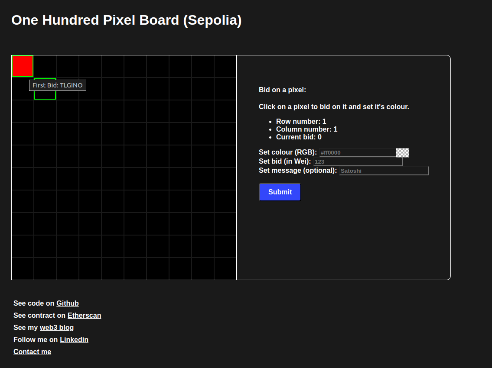

# One Hundred Pixel Board

## Idea:

This is a sample project that I'll be working on to help me learn Solidity.

## Plan:

Construct a 10x10 board of pixels where the colour of each pixel is set by the highest bidder.
Users can optionally also attach a message to the bought pixel.

## Result:

See it online: [https://onehundredpixelboard.lettry.xyz](https://onehundredpixelboard.lettry.xyz)

See contract on [etherscan](https://sepolia.etherscan.io/address/0xB9bDB1084Bcb8B7D12082c8Ba9b410BF62cF563B)

**Disclaimer**: hosted on Sepolia network

